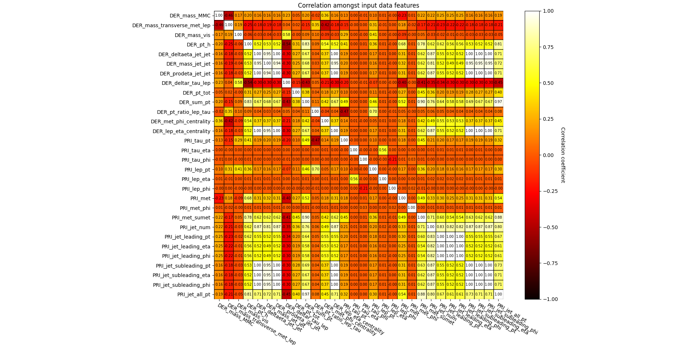

# ML-EPFL
Solutions to Machine Learning Projects at EPFL\
Link to the [dataset and submission platform](https://www.aicrowd.com/challenges/epfl-machine-learning-higgs).\

# Project Structure
- `src` directory contains all files related to the source code.
- `dataset` directory contains the dataset.
- `test` directory contains the code for testing / verifying correctness or accuracy.
- `docs` directory contains everything related to writing documentation for our work.
- `setup.sh` is the script to use for installing the dependencies into the machine which will run this project. (Supports installing dependencies for linux environments only).

# File Descriptions
**dataset/train.csv** - Training set of 250000 events. The file starts with the `ID` column, then the label column (the y you have to predict), and finally 30 feature columns.\
**dataset/test.csv** - The test set of around 568238 events - Everything as above, except the label is missing.\
**dataset/sample-submission.csv** - a sample submission file in the correct format. The sample submission always predicts -1, that is `background`.

For detailed information on the semantics of the features, labels, and weights, see the technical documentation from the LAL website on the task. Note that here for the EPFL course, we use a simpler evaluation metric instead (classification error).

#### Some details about the datasets:
- All variables are floating point, except PRI_jet_num which is integer
- Variables prefixed with `PRI` (for PRImitives) are “raw” quantities about the bunch collision as measured by the detector.
- Variables prefixed with `DER` (for DERived) are quantities computed from the primitive features, which were selected by the physicists of `ATLAS`.
- It can happen that for some entries some variables are meaningless or cannot be computed; in this case, their value is −999.0, which is outside the normal range of all variables.`

# Running the Code

- Make sure that the train.csv and the test.csv files are in the /dataset folder.
- Execute the run.py file in the top level directory. 
- Wait a few minutes as the model trains over the whole dataset with the best hyperparameters.
- The performance on the testing set may vary slightly due to randmoness in our trainnig process.

# Pipeline Summary

Here are the main steps that are executed when the run.py script is launched.
## Training
- Loading data from the train.csv file in the /dataset folder
- Data preprocessing
- Grid-search for the best hyperparameters with kfold cross validation for each hyperparameter combination. Note that in our final submission, the best hyperparameters have already been determined and this step is skipped
- Using the best hyperparameters, retrain the model over the whole dataset

## Testing
- Loading data from the test.csv file in the /dataset folder
- Data preprocessing
- Label prediction
- Write restuls to the `submission.csv` file in the `/dataset` folder

# Preprocessing

## Final Model

Here is a description of the preprocessing steps that gave us the best performance. 

- Feature selection: Only the DER features are used from the dataset. The PRI features were highly correlated with them and gave little new predictive information to our models. The training was faster and the results slightly better when the PRI features were dropped.
- Replacing invalid values: Each invalid value (-999.0) is replaced by the median value of its corresponding feature
- Clip outliers: Outliers are defined as being values that fall further than 3 standard deviations from the mean of their feature (assuming a Gaussian distribution). The value of these outliers is replaced by the mean $+/-$ 3 standard deviations.
- Standardize: Transform the data so each feature has a mean of zero and a standard deviation of one.
- Feature expansion: Polynomial feature expansion of x. The resulting vector is of shape $(N,D*d)$ where $d$ is the degree of the polynomial expansion
- Add offset term: A new feature of all ones is prepended to x as an offset term in our models.

The correlations among `DER_` and `PRI_` features are shown in the image below:

## Other preprocessing steps that were attempted

Here is a description of all the other preprocessing steps that were used during our experimentation, but were not kept for the final model as they gave worse performance.

- Outlier removal: Remove all samples with outliers from the dataset. An outlier is defined as having a value that is more than $3$ standard deviations away from the mean of the feature. Outlier removal increased training and validation accuracy by $8\%$ to $10\%$ percent depending on the model used, but it decreased accuracy by almost as much on the testing set as samples with outliers could not be ignored when testing. 
- Standardization with robust statistics: Due to the large amount of outliers in the data, we tried normalizing with the 25th percentile, 75th percentile, and the interquartile range to be more robust to outliers. Although this technique was very promising, it gave worst performance during trainig, validation, and testing and was therefore not used in the final model.
- Changing the definition of outliers: Define outliers as values being more than $2$ standard deviations away from the mean of their feature instead of $3$. 
- Principal Components Analysis: Use the eigenvalue decomposition of the input samples $x$ to learn a better and more compact representation of the features. The number of features was selected so that the new representation kept $95\%$ percent of the explained variance of the original features. PCA greatly decreased trainng time, but did not yield as good of a performance as our final feature selection method. PCA is only used for KNN, where it is crucial to limit the number of dimensions used.
- Use different preprocesssing steps with training and testing: When using any combinations of the methods described above, we found that using different prerocssing methods for training and testing always yielded worst testing performance, even though training performance could be greatly increased.

# Models

Here is a list of the models that were used for the project. The best model was selected from its loss within its own model class (linear and logistic regression, KNN) and using accuracy as well as F1 score between different model classes. Since different model classes use different loss functions, their loss cannot be compared directly.

## Linear Regression

- Mean squared error gradient descent: Linear regression with Mean Squared Error (MSE) using the gradient descent algorithm
- Mean squared error stochastic gradient descent: Linear regression with Mean Squared Error (MSE) using the stochastic gradient descent algorithm
- Least squares: Linear regression using the normal equations (closed-form solutions)
- Ridge regression: Linear regression using the normal equations (closed-form solutions) as well as ridge regression (L2)

## Logistic Regression

- Logistic regression: Logistic regression using the gradient descent algorithm or Newton's method.
- Logistic regression with regularization: Logistic regression using the gradient descent algorithm with L2 regularization.

## K Nearest Neighbors (KNN)

- Rudimentary implementation of KNN. No data structure was used for efficiently storing the data which makes the training and evaluation very slow. The class of a sampled is predicted with a majority vote from the k nearest neighbors of the sample. The distance is calculated using euclidean distance. 
- There is an extra preprocessing step for KNN due to the underlying assumptions of the model being different. Principal component analysis (PCA) is used to reduce the dimensionality of the data since we do not have enough data to justify using all the DER features. The resulting representation has 3 (new) features constructed with PCA.

# Training and Validation

The test data is loaded from the train.csv dataset and is preprocessed with the steps mentionned in the Preprocessing section.

During our experimentations, the training was searching for the best hyperparameters to use in our final model.For each model, hyperparameters included gamma, lambda, the maximum number of iterations for gradient descent, the degree of the polynomial expansion, the number of standard deviaitons from which to start clipping outliers, other values in the preprocessing steps.

For each hyperparameter combination, the models were trained using K-fold cross validation. The average loss, accuracy, and F1 score over all the folds were used to select the best hyperparameters.

Once the best combination of hyperparameters was determined, the model was trained over the whole training set with these parameters. When modifying hyperparameters of the preprocessing steps, the preprocessing also had to be done from scartch.

At the end of the training, the model weights of the best model are determined. They will then be used for testing.

# Testing

The test data is loaded from the `test.csv` file and is preprocessed with the same steps as during the training.

From the trained model weights, labels are predicted on the test data. The labels and their correesponding id are then stored in the `submission.csv` file in the `/dataset` folder. That file can then be used for submission on the competition on AIcrowd and is the output of the program.

# Authors
Maxime Bourassa\
Nitish Ravishankar\
Agastya Jha
